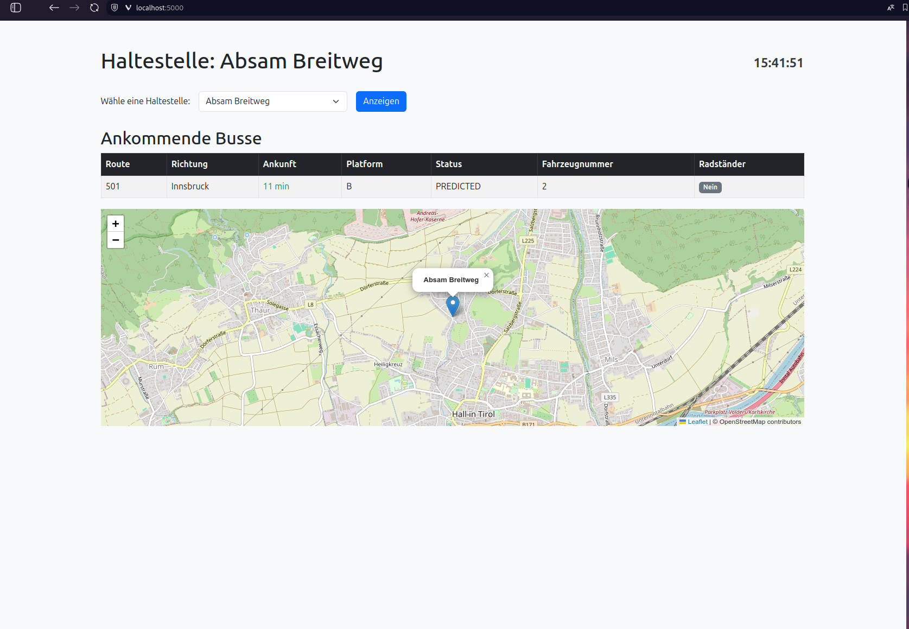
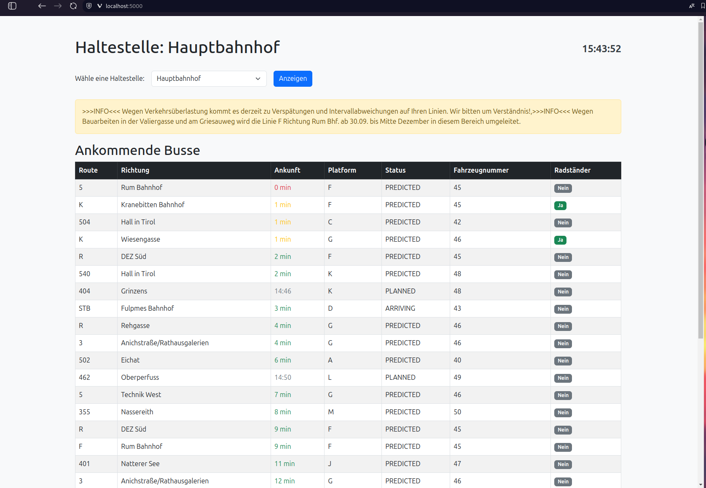

# Echtzeit Bus-Haltestelleninformationen


## Inhaltsverzeichnis

- [Überblick](#überblick)
- [Funktionen](#funktionen)
- [Screenshots](#screenshots)
- [Installation](#installation)
- [Verwendung](#verwendung)
- [Projektstruktur](#projektstruktur)
- [API-Referenzen](#api-referenzen)
- [Lizenz](#lizenz)
- [Danksagungen](#danksagungen)
- [Contact](#contact)

## Überblick

**Echtzeit Bus-Haltestelleninformationen** ist eine Flask-basierte Webanwendung, die Benutzern aktuelle Informationen zu Busankünften an verschiedenen Haltestellen bereitstellt. Die Anwendung greift auf externe APIs zu, um Echtzeitdaten zu Busfahrplänen, Routen, Ankunftszeiten und Plattforminformationen anzuzeigen. Die Benutzeroberfläche enthält eine dynamische Uhr, farblich codierte Ankunftszeiten zur Anzeige der Dringlichkeit sowie eine interaktive Karte, die die Position der Busse anzeigt.

## Funktionen

- **Haltestellenauswahl**: Wähle aus einer Dropdown-Liste aller verfügbaren Haltestellen.
- **Echtzeit-Busdaten**: Anzeige aktueller Busfahrpläne mit Informationen zu Route, Richtung, Ankunftszeit, Plattform, Status, Fahrzeugnummer und Radständer.
- **Farbkodierung der Ankunftszeiten**:
  - **Rot**: Bus fährt sofort ab (`0 min`).
  - **Gelb**: Bus fährt in einer Minute ab (`1 min`).
  - **Grün**: Bus hat mehr als eine Minute Zeit.
  - **Grau**: Geplante Abfahrten oder andere Zeitformate.
- **Automatische Aktualisierung**: Die Busdaten werden alle 30 Sekunden automatisch aktualisiert.
- **Digitale Uhr**: Eine Echtzeituhr zeigt die aktuelle Uhrzeit des Benutzers an und aktualisiert sich jede Sekunde.
- **Interaktive Karte**: Anzeige der Haltestelle und aktueller Buspositionen auf einer Leaflet-Karte.
- **Benutzerfreundliches Design**: Responsives Layout mit Bootstrap für optimale Darstellung auf verschiedenen Geräten.

## Screenshots

<!-- Optional: Füge Screenshots deiner Anwendung hinzu -->




## Installation

### Voraussetzungen

- **Python**: Version 3.7 oder höher
- **pip**: Python Package Installer

### Schritte

1. **Repository klonen**

    ```bash
    git clone https://github.com/deinbenutzername/bus-haltestellen-info.git
    cd bus-haltestellen-info
    ```

2. **Virtuelle Umgebung erstellen (optional, empfohlen)**

    ```bash
    python3 -m venv venv
    source venv/bin/activate  # Auf Windows: venv\Scripts\activate
    ```

3. **Abhängigkeiten installieren**

    ```bash
    pip install flask requests
    ```

4. **Anwendung starten**

    ```bash
    cd TDOT_IVB
    python app.py
    ```

5. **Auf die Anwendung zugreifen**

    Öffne deinen Webbrowser und navigiere zu [http://127.0.0.1:5000/](http://127.0.0.1:5000/).

## Verwendung

1. **Haltestelle auswählen**

    Wähle eine Haltestelle aus dem Dropdown-Menü aus und klicke auf "Anzeigen", um die Busdaten an dieser Haltestelle zu sehen.

2. **Busdaten ansehen**

    Die Tabelle zeigt ankommende Busse mit detaillierten Informationen. Die Ankunftszeiten sind farblich gekennzeichnet, um die Dringlichkeit der Abfahrt zu verdeutlichen.

3. **Karte anzeigen**

    Die interaktive Karte zeigt den Standort der ausgewählten Haltestelle und die aktuellen Positionen der Busse an.

4. **Uhrzeit beobachten**

    Die digitale Uhr oben rechts zeigt die aktuelle Uhrzeit an und wird jede Sekunde aktualisiert.

## Projektstruktur

```bash
flask_app/
│
├── app.py                 # Hauptanwendungsdatei
├── README.md              # Projektbeschreibung
├── templates/
│   └── index.html         # HTML-Template für die Startseite
└── static/
    ├── css/               # CSS-Dateien (optional noch im Index.html)
    ├── js/                # JavaScript-Dateien (optional noch im Index.html)
    └── images/            # Bilddateien (optional noch im Index.html)
```

- **app.py**: Enthält die Flask-Anwendung, Routen und Funktionen zur Datenbeschaffung und -verarbeitung.
- **templates/index.html**: Das HTML-Template für die Startseite, das die Busdaten, Uhr und Karte darstellt.
- **static/**: Enthält statische Dateien wie CSS, JavaScript und Bilder.

## API-Referenzen

Die Anwendung verwendet zwei externe APIs von [smartinfo.ivb.at](https://smartinfo.ivb.at/):

1. **Haltestellen-API**

    - **URL**: `https://smartinfo.ivb.at/api/JSON/STOPS`
    - **Beschreibung**: Liefert eine Liste aller verfügbaren Haltestellen mit Details wie Name, UID, Geokoordinaten etc.

2. **Passagen-API**

    - **URL**: `https://smartinfo.ivb.at/api/JSON/PASSAGE`
    - **Parameter**: `stopID` (UID der Haltestelle)
    - **Beschreibung**: Liefert aktuelle Passagen-Daten für die angegebene Haltestelle, einschließlich Businformationen.

## Lizenz

Dieses Projekt steht unter der [GNU General Public License v3.0](https://www.gnu.org/licenses/gpl-3.0.de.html).

## Danksagungen

- [Flask](https://flask.palletsprojects.com/)
- [Bootstrap](https://getbootstrap.com/)
- [Leaflet](https://leafletjs.com/)
- [SmartInfo IVB API](https://smartinfo.ivb.at/)
- [jQuery](https://jquery.com/)
- [Leaflet Rotated Marker Plugin](https://github.com/bbecquet/Leaflet.RotatedMarker)


## Contact
- Email: luna.schaetzle.website@gmail.com
- GitHub: [luna-schaetzle](https://github.com/Luna-Schaetzle)
- Meiner Website: [luna-schaetzle.github.io](https://luna-schaetzle.github.io/)


